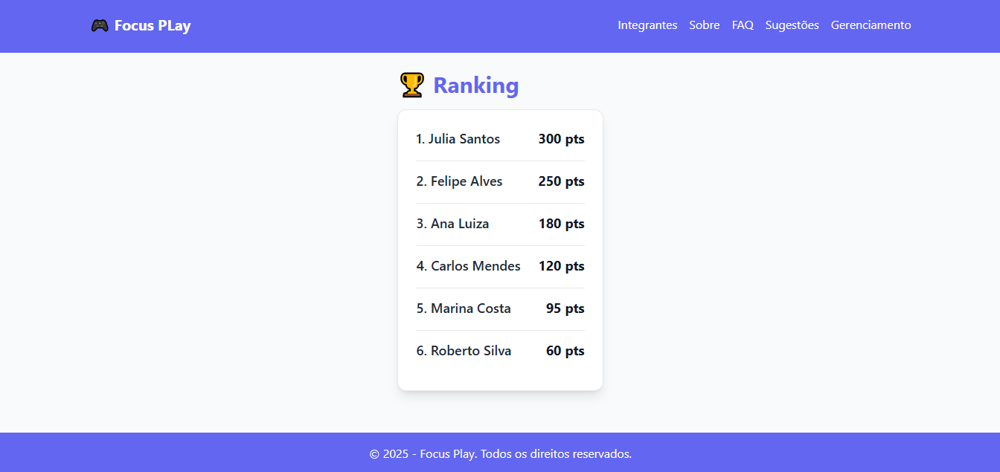
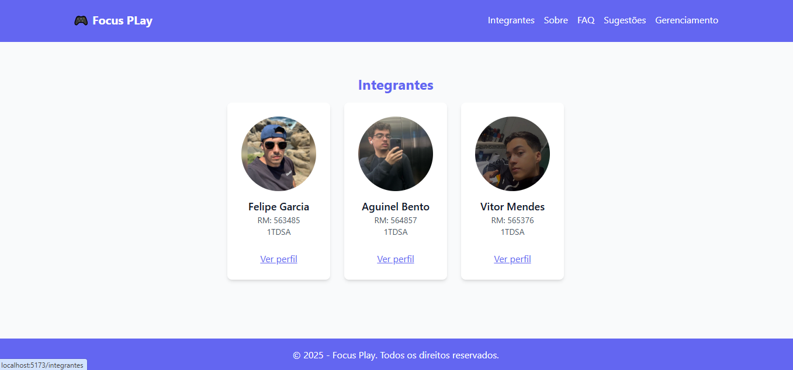
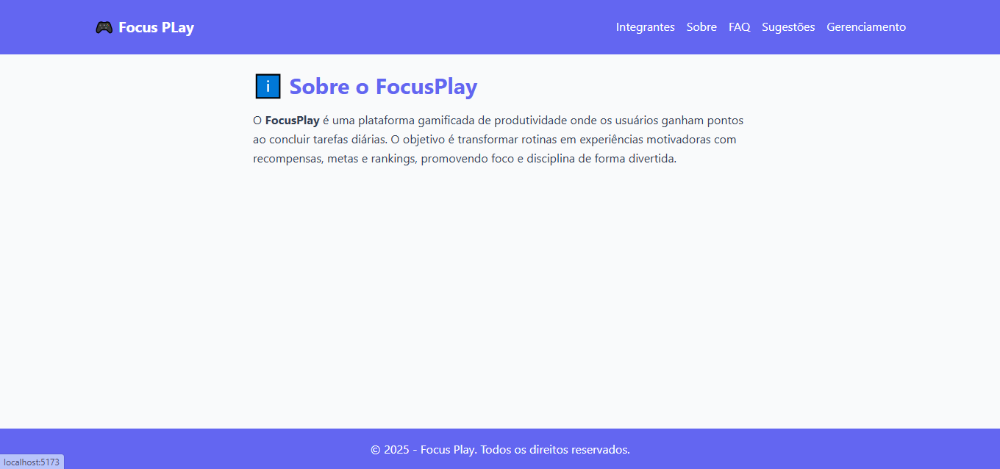
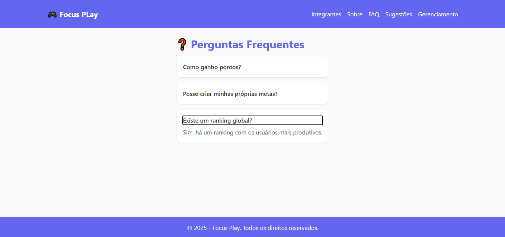
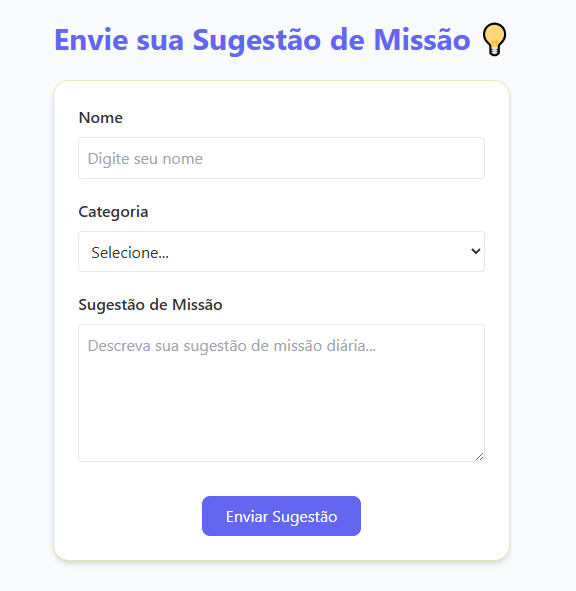

# FocusPlay – Plataforma Gamificada de Produtividade

## 📌 Descrição

Um sistema que transforma produtividade em diversão através de tarefas, missões diárias e ranking de usuários.

## 📊 Status do Projeto

Concluído

## 🧭 Sumário

-   [Sobre o Projeto](#-sobre-o-projeto)
-   [Tecnologias Utilizadas](#-tecnologias-utilizadas)
-   [Instalação](#-instalação)
-   [Como Usar](#-como-usar)
-   [Estrutura de Pastas](#-estrutura-de-pastas)
-   [Rotas Principais](#-rotas-principais)
-   [Autores e Créditos](#-autores-e-créditos)
-   [Screenshots](#-screenshots)
-   [Contato](#-contato)
-   [Links](#-links)

## 📘 Sobre o Projeto

FocusPlay é uma plataforma gamificada que incentiva produtividade através de pontuação, tarefas e missões diárias.
O usuário ganha pontos ao concluir ações, sobe no ranking e pode visualizar seu progresso.

Funcionalidades principais:

✔️ Cadastro de Usuários

✔️ Cadastro e controle de Tarefas

✔️ Missões diárias com pontuação

✔️ Ranking atualizado de usuários

## 🛠 Tecnologias Utilizadas

- React.js
- TypeScript
- React Router DOM
- React Hook Form
- Vite
- TailwindCSS

- react ^19.1.1
- react-dom ^19.1.1
- react-hook-form ^7.45.1
- react-router-dom ^6.30.1
- vite ^7.1.7
- typescript ~5.8.3
- tailwindcss ^3.4.

## 💾 Instalação

# Clone o repositório
git clone https://github.com/usuario/repositorio.git

# Acesse a pasta do projeto
cd repositorio

# Instale as dependências
npm install

# Execute o projeto
npm run dev

## ▶️ Como Usar

1.  Abra o navegador no endereço exibido pelo Vite.
2.  Navegue até a página de gerenciamento de usuários.
3.  Utilize os botões para **cadastrar**, **editar**, **listar** e
    **excluir** usuários.
4.  Todas as ações são processadas localmente para fins acadêmicos.

## 📁 Estrutura de Pastas

gs-front/
├── .git/                
├── index.html                
├── package.json                  
├── vite.config.ts             
├── tsconfig.json                 
├── tsconfig.app.json             
├── README.md                    
│
├── src/
│   ├── main.tsx                 
│   ├── App.tsx                  
│   ├── index.css                
│   │
│   ├── assets/                   
│   │   ├── Aguinel.jpg
│   │   ├── Felipe.jpg
│   │   └── Vitor.png
│   │
│   ├── components/             
│   │   ├── Header.tsx
│   │   ├── Footer.tsx
│   │   └── IntegranteCard.tsx
│   │
│   ├── pages/                  
│   │   ├── About.tsx
│   │   ├── Faq.tsx
│   │   ├── Gerenciamento.tsx
│   │   ├── Home.tsx
│   │   ├── Integrantes.tsx
│   │   ├── IntegrantesDetail.tsx
│   │   ├── MissaoDiariaCrud.tsx
│   │   ├── Sugestoes.tsx
│   │   ├── TarefaCrud.tsx
│   │   ├── UsuarioCrud.tsx
│   │   └── NotFound.tsx
│   │
│   └── services/                 
│       └── api.ts
│
└── public/      
    └── vite.svg

## 🔗 Rotas Principais

  Rota                     Descrição
  Home                     Pagina inicial
  Gerenciamente            Pagina de gerenciamnete de CRUD's
  Usuario                  Pagina para criar,listar,atualizar e deletar usuarios
  Tarefa                   Pagina para criar,listar,atualizar e deletar tarefas
  MissaoDiaria             Pagina para criar,listar,atualizar e deletar missaoDiarias

## 👥 Autores e Créditos

Felipe Garcia

Aguinel Bento

Vitor Mendes

## 🖼 Screenshots

## 📞 Contato

Para dúvidas ou melhorias:\
📧 rm563485@fiap.com.br

## 🔗 Links

Repositório GitHub: https://github.com/Felipesgh/gs-front

Vídeo YouTube: https://youtu.be/NAfWk14x24k

Deploy Versel: https://gs-front-six.vercel.app/